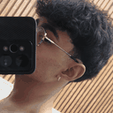

# Zaid-FX-MOD

<p align="center">
  
</p>

Android-first final-frame post-processing and visual presets for Geometry Dash using Geode.

> **v0.2.1:** fixes preset application, adds lightweight bloom, chromatic aberration and tone mapping, and replaces the previous artwork with the exact user-provided image as the official mod icon.

## Presets

Changing the preset now immediately runs one central `applyPreset(presetId)` operation. It loads every value, writes the Geode settings, updates the visible slider values, updates the active renderer state and queues the new uniforms for the next presented frame.

Available profiles:

- **Default:** neutral output.
- **Cinematic:** stronger contrast, slightly reduced saturation, vignette and tone mapping.
- **Vibrant:** brighter image with stronger saturation.
- **Dark:** reduced exposure with stronger contrast.
- **Retro:** reduced saturation, vignette and chromatic aberration.
- **RTX:** bloom, sharpening, bright highlights and stronger tone mapping. This is a stylized post-processing profile, not hardware ray tracing.

Moving any numeric slider after a preset is applied changes the preset label to **Custom** without disabling the effects.

## Live visual controls

Every control is sent to the shader on every processed frame:

- Effect intensity: `u_intensity`
- Brightness: `u_brightness`
- Exposure: `u_exposure`
- Contrast: `u_contrast`
- Saturation: `u_saturation`
- Gamma: `u_gamma`
- Bloom: `u_bloom`
- Vignette: `u_vignette`
- Sharpen: `u_sharpen`
- Chromatic aberration: `u_chromaticAberration`
- Tonemapping: `u_tonemapping`
- Pixel size: `u_texelSize`
- Red framebuffer test: `u_debugRed`

## Final-frame rendering

The effect continues to run from `CCEGLView::swapBuffers`, after Geometry Dash completes the menu or gameplay frame and immediately before Android presents it. The final framebuffer is copied into a texture and drawn back through a fullscreen GLSL quad.

## Official logo

The repository root `logo.png` and the in-game `ZaidFXLogo.png` sprite are derived directly from the image supplied by Zaid Navarro. The image is center-cropped to a square without stretching. The in-game button retains a safe Geometry Dash fallback if the texture cannot be loaded.

## Diagnostics

The temporary debug logs record:

- selected preset and internal ID,
- all loaded preset values,
- each slider assignment,
- renderer values,
- every uniform update,
- shader refresh confirmation,
- framebuffer, texture, program and fullscreen-quad state.

## Updates inside Geode

Automatic in-app updates require the mod's first approved submission to the official Geode Index. GitHub releases are versioned automatically after a successful merge into `main`.

## Developer and contact

**Zaid Navarro**

- Instagram: [@Zaid.nvr](https://www.instagram.com/Zaid.nvr/)
- WhatsApp: [+52 33 4515 8805](https://wa.me/523345158805)
- Email: [zaidnavarrosaucedo@gmail.com](mailto:zaidnavarrosaucedo@gmail.com)
- Source code and issues: [Fernan20881208/Zaid-FX-MOD](https://github.com/Fernan20881208/Zaid-FX-MOD)

## Build from source

```bash
geode sdk install-binaries -p android64
geode build -p android64
```

## License

MIT
